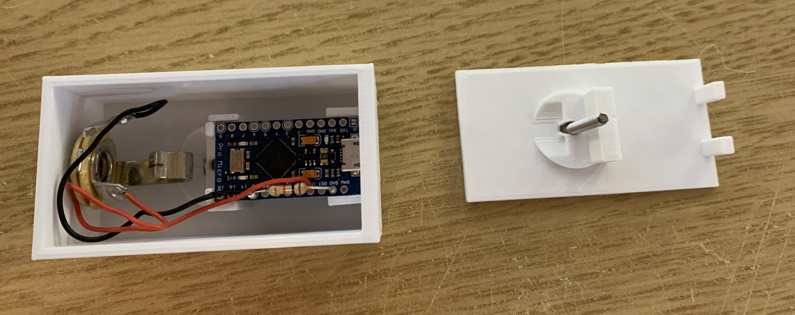
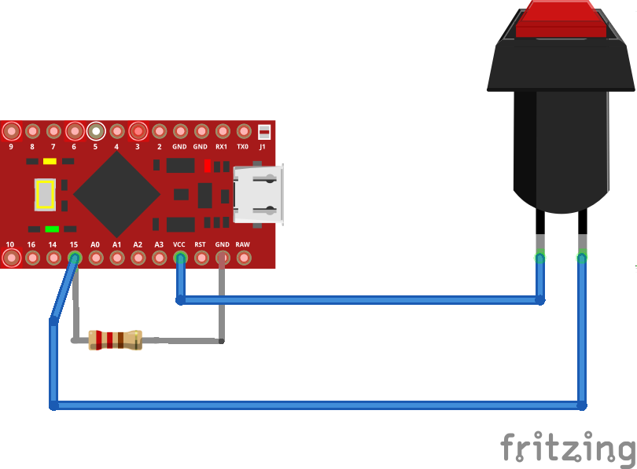
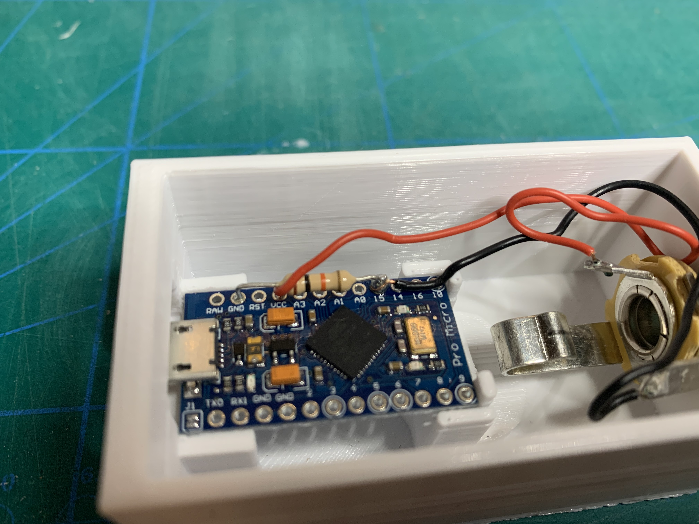
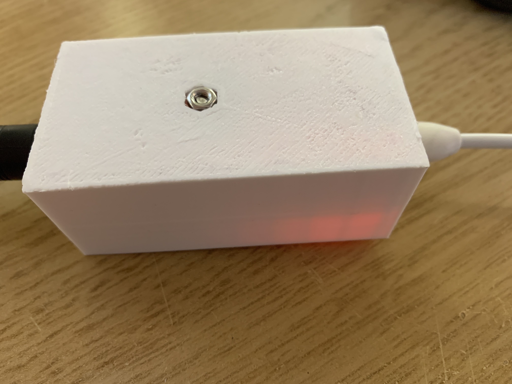
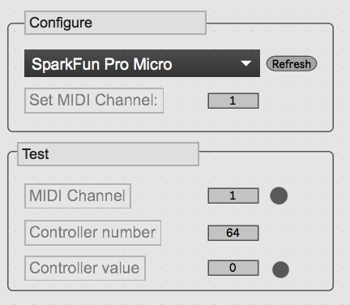

# Sustain pedal adapter
Simple adapter from sustain pedal to sustain MIDI signal.

This repositor contains:
 - 3D models of case
 - Schematics
 - Firmware

I bought new fancy and small MIDI controllers lacking sustain pedal jack input and really missed this feature.

## How to make it

An Arduino Pro Micro is the heart of the unit.

The arduino detect switch signals (closed circuit) and sends an according MIDI CC 63 on a chosen MIDI port.

Firmware has been developed for platform.io, but should work perfectly on Arduino IDE.

## MIDI Implementation chart

| Function | Transmitted| Recognized | Remarks | 
|---|---|---|---|
| Basic Channel | 1- 16 | x | Configurable. Send CC 01 to set channel. Eg. CC 01, value 3 sets MIDI channel 3
| Note number | x | x |
| Control Change | x  | 1 | Sets MIDI Output channel. Use 1 for MPE.
| Control Change | 64  | 0 / 100 | Sustain pedal. 0 = off, 100 = on

A simple Max Patch (see GUI directory) may be used to configure and test the pedal

## Bill of Materials
 - 10k resistor (or similar)
 - Arduino Pro Micro
 - Jack

And of course:
 - Sustain pedal
 - Computer with USB
 - USB cable

# Credits
- [Arduino Pro Micro 3D model by NaaP April 25, 2019](https://www.thingiverse.com/thing:3588185)